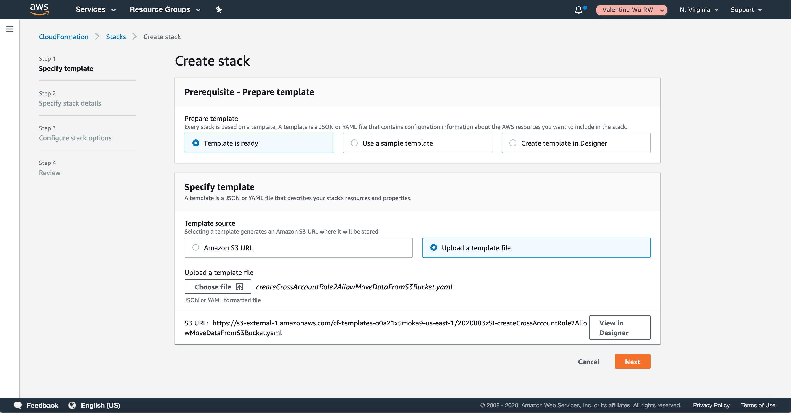
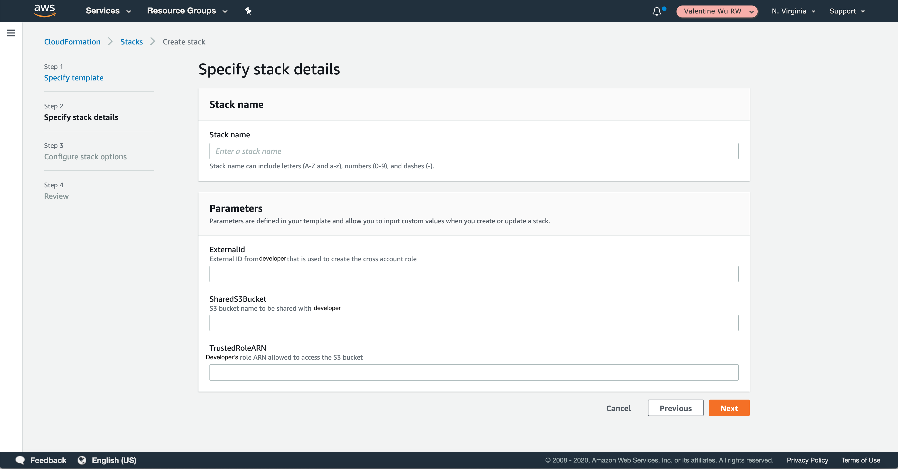

# Creating a Stack for Cross-Account Role Setup on the AWS CloudFormation Console
For developer to consume the data in S3 bucket on customer side, you have to set up a cross account role and give the required information to developer (S3 bucket name, ARN of the created cross-account role, S3 region).

When you use AWS CloudFormation, you work with templates and stacks. You create templates to describe your AWS resources and their properties. Whenever you create a stack, AWS CloudFormation provisions the resources that are described in your template.

Here a CloudFormation template is provided to the customer so that you can create a stack to set up the cross account role.

## Templates
An AWS CloudFormation template is a JSON or YAML formatted text file. You can save these files with any extension, such as .json, .yaml, .template, or .txt. AWS CloudFormation uses these templates as blueprints for building your AWS resources. 

## Stacks
When you use AWS CloudFormation, you manage related resources as a single unit called a stack. You create, update, and delete a collection of resources by creating, updating, and deleting stacks. All the resources in a stack are defined by the stack's AWS CloudFormation template. Suppose you created a template that includes an Auto Scaling group, Elastic Load Balancing load balancer, and an Amazon Relational Database Service (Amazon RDS) database instance. To create those resources, you create a stack by submitting the template that you created, and AWS CloudFormation provisions all those resources for you. You can work with stacks by using the AWS CloudFormation console, API, or AWS CLI.

## Template to Create a Stack for Cross Account Role Setup - Provided by Developer
- One trusted role
- Multiple trusted roles

## Input Parameters
- **External ID** (provided by developer): Used in an IAM role trust policy to designate who can assume the role (https://docs.aws.amazon.com/IAM/latest/UserGuide/id_roles_create_for-user_externalid.html)
- **SharedS3Bucket** (provided by customer): Bucket name shared with developer by customer.
- **TrustedRoleARN** (provided by developer): Amazon resource name of the role which will assume the cross account role.

## Output Parameters
- **S3Region**: The AWS region where S3 bucket is created.
- **CrossAccountRoleARN**: Amazon resource name of the cross account role created by the stack.

## Steps to Create a Stack Using the Template
- Log in to the AWS Management Console and select **CloudFormation** in the **Services** menu.
- Create a new stack by using one of the following options:
  - Click **Create Stack**. This is the only option if you have a currently running stack.
  - Click **Create Stack** on the **Stacks page**. This option is visible only if you have no running stacks.    
- On the **Specify template** page: 
  - Choose **Template is ready** in the **Prerequisite - Prepare template** section .
  - Choose **Upload a template file** in the **Specify template** section. Choose **Choose File** to select the template file that you are given as the above. The template can be a maximum size of 460,800 bytes. Once you have chosen your template, CloudFormation uploads the file and displays the S3 URL.
  - To accept your settings, choose **Next**. Before creating resources, AWS CloudFormation validates your template to catch syntactic and some semantic errors, such as circular dependencies. During validation, AWS CloudFormation first checks if the template is valid JSON. If it isn't, AWS CloudFormation checks if the template is valid YAML. If both checks fail, AWS CloudFormation returns a template validation error.
- On the **Specify stack details** page: 
  - Type a stack name in the **Stack name** box. The stack name is an identifier that helps you find a particular stack from a list of stacks. A stack name can contain only alphanumeric characters (case-sensitive) and hyphens. It must start with an alphabetic character and can't be longer than 128 characters.
  - In the **Parameters** section, specify parameters that are defined in the stack template and provided by developer.
  - When you are satisfied with the parameter values, click **Next**.
