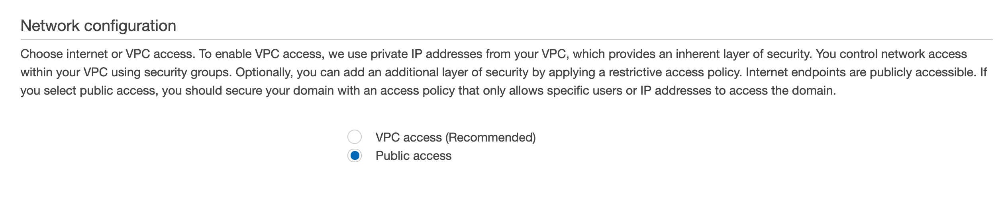

# Access and Security Configuration - Public Access

Amazon Elasticsearch Service offers numerous security features, including fine-grained access control, IAM, Cognito authentication for Kibana, encryption, and VPC access. 

## Network configuration

Choose internet or VPC access. To enable VPC access, we use private IP addresses from your VPC, which provides an inherent layer of security. You control network access within your VPC using security groups. Optionally, you can add an additional layer of security by applying a restrictive access policy. Internet endpoints are publicly accessible. If you select public access, you should secure your domain with an access policy that only allows specific users or IP addresses to access the domain.

## Public access

Here we use public access as selected in Amazon Management Console:


# Enable Amazon Elasticsearch Service Operations with Fine-Grained Access Control

## The Gradle project contains Java source code to:
- implement a Lambda function;
- receive CloudFormation custom resource request for
        - Amazon Elasticsearch domain creation with fine-grained access control;
        - Amazon Elasticsearch domain update;
        - Amazon Elasticsearch domain deletion.
- send CloudFormation custom resource response;

## Build the Gradle Project
```
./gradlew clean
./gradlew build
```

## Java Artifact
After successful build, there is a zip file in ./build/distributions directory (for example, `ElasticsearchPublicFineGrainedAccess-1.0.zip`) for CloudFormation custom resource to use. 


## Test
1. Upload the Java artifact to S3 folder (specified in the `template.yaml`);
2. Run the `startup.sh`;
3. Open a browser to the endpoint returned to access Elasticsearch with the provided username and password or access it through a terminal.

## Cleanup
Run `cleanup.sh` to release all AWS resources.

# References:
- https://docs.aws.amazon.com/lambda/latest/dg/services-cloudformation.html
- https://docs.aws.amazon.com/elasticsearch-service/latest/developerguide/es-configuration-samples.html
- https://docs.aws.amazon.com/AWSCloudFormation/latest/UserGuide/cfn-lambda-function-code-cfnresponsemodule.html
- https://hub.alfresco.com/t5/alfresco-platform-services-blog/how-a-lambda-backed-custom-resource-saved-the-day/ba-p/286986
- https://stackoverflow.com/questions/32811947/how-do-we-access-and-respond-to-cloudformation-custom-resources-using-an-aws-lam

