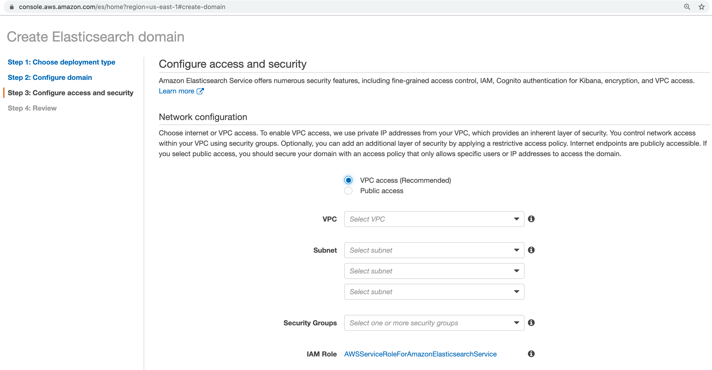

# Access and Security Configuration - VPC Access

Amazon Elasticsearch Service offers numerous security features, including fine-grained access control, IAM, Cognito authentication for Kibana, encryption, and VPC access. 

## Network configuration

Choose internet or VPC access. To enable VPC access, we use private IP addresses from your VPC, which provides an inherent layer of security. You control network access within your VPC using security groups. Optionally, you can add an additional layer of security by applying a restrictive access policy. Internet endpoints are publicly accessible. If you select public access, you should secure your domain with an access policy that only allows specific users or IP addresses to access the domain.

## VPC access

Here we use vpc access as selected in Amazon Management Console:

